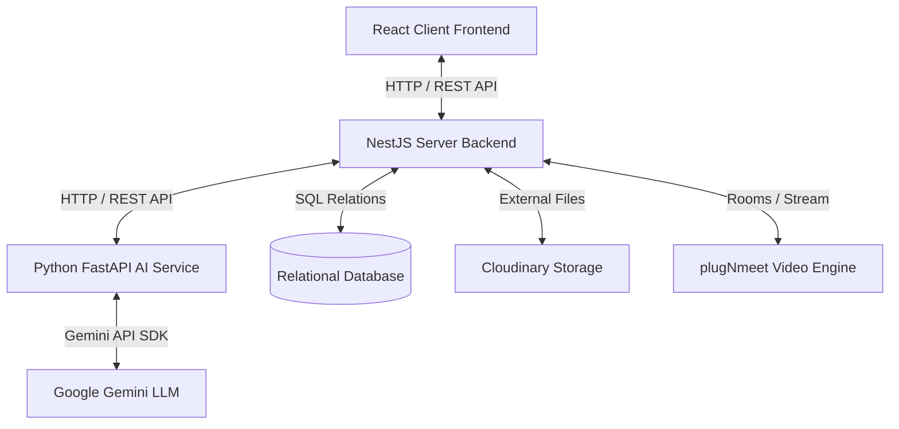

# SAMS: Student Activity Management System

SAMS is an all-in-one digital ecosystem built to manage student-run organizations, clubs, and university branches. From initial applicant recruitment to weekly sessions, homework grading, compatibility quizzes, and video meetings, SAMS unifies student interactions under a single dashboard.

---

## 🏗️ Repository Architecture

The SAMS monorepo is divided into three key services:



### 1. [React Frontend (`/client`)](./client/README.md)
* **Core Tech**: React, Vite, Tailwind CSS, Lucide React, Shadcn UI.
* **Purpose**: Serves interactive, role-based dashboards for Executives (system config), Directors (committee oversight), Members (learning center), and the Public (application forms & compatibility tests).

### 2. [NestJS Backend API (`/server`)](./server/README.md)
* **Core Tech**: NestJS, TypeScript, TypeORM, Passport JWT, Nodemailer.
* **Purpose**: The central API gateway managing user roles (RBAC), database states, automated email dispatches, and third-party integrations (Cloudinary, plugNmeet).

### 3. [Python AI Service (`/ai-service`)](./ai-service/README.md)
* **Core Tech**: FastAPI, PyPDF/python-docx parsers, Google Gemini SDK.
* **Purpose**: Performs candidate screening (structured CV scoring against custom committee criteria) and powers conversational mock interview agents.

---

## 🚀 Key Features & End-to-End Workflows

### 📢 Automated Recruitment Pipeline
1. **Opening Positions**: Executives configure vacancies for specific committees or global administrative roles (setting targets and custom opening/closing dates).
2. **Application & Quiz**: Public candidates take a compatibility quiz to discover suitable tracks, submit an application form, and upload their CV.
3. **AI CV Screening**: The NestJS server forwards candidate documents to the FastAPI AI Service, which parses the files and generates scores (Technical compatibility, Analytical compatibility, and Experience out of 10) against `committee_requirements.json` rubrics.
4. **Interview & Decision**: Directors review candidates' profiles and AI summaries, schedule meetings, and update application statuses. Status changes automatically trigger transactional emails (e.g., acceptance or rejection notifications).

### 🎓 Learning Management System (LMS)
* **Roadmaps**: Directors construct educational paths divided into session chapters.
* **Materials**: Share technical documents and files uploaded to Cloudinary storage.
* **Tasks & Submissions**: Assign homework tasks with deadlines. Members submit link/file answers, which directors grade and comment on directly.

### 🎥 Live Workshops & Collaboration
* **plugNmeet Conferences**: Directors generate meeting rooms directly from their panel. Links are immediately shared with members for live, in-app video lectures.
* **Attendance Logs**: Keeps chronological records of student presence and absence during scheduled workshops.

### 🛡️ Auditing & Security
* **Audit Trails**: Central interceptor logs all administrative modifications (updates, status flips, creations) with user IDs, routes, and timestamps.

---

## 📂 Directory Layout

```text
SAMS/
├── client/              # React frontend (Vite environment)
├── server/              # NestJS backend API
├── ai-service/          # FastAPI Python AI microservice
└── README.md            # Main monorepo orchestrator configuration
```

For domain details, setup configurations, and file systems, read the sub-directory documentation:
* 🖥️ **Frontend Details**: Check the [Client README](./client/README.md).
* ⚙️ **Backend Details**: Check the [Server README](./server/README.md).
* 🧠 **AI Service Details**: Check the [AI Service README](./ai-service/README.md).

---

## 🛠️ Step-by-Step Local Setup

To launch SAMS locally, run all three services in parallel:

### 1. Database & Server Setup
1. Configure your relational database (PostgreSQL/MySQL) and populate the configuration in `server/.env` (see template in the [Server README](./server/README.md#-installation--setup)).
2. Install dependencies, run database seeds, and start the development server:
   ```bash
   cd server
   npm install
   npm run seed
   npm run start:dev
   ```

### 2. Python AI Service Setup
1. Configure your `ai-service/.env` file with a Google Gemini API key:
   ```env
   GEMINI_API_KEY=your_gemini_api_key
   ```
2. Set up a Python virtual environment and launch FastAPI:
   ```bash
   cd ai-service
   python -m venv venv
   # On Windows:
   venv\Scripts\activate
   # On Mac/Linux:
   source venv/bin/activate
   pip install -r requirements.txt
   python -m app.main
   ```

### 3. Frontend Client Setup
1. Install client dependencies and run the Vite server:
   ```bash
   cd client
   npm install
   npm run dev
   ```
2. Open the application in your browser at `http://localhost:5173`.
